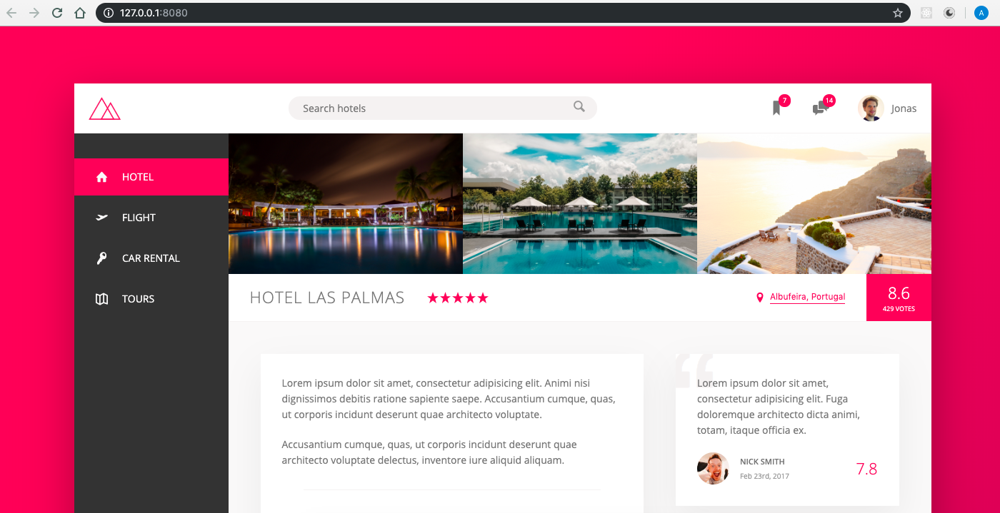

# Trillo

This project is based on the course by Jonas Schmedtmann ["Advanced CSS and Sass"](https://www.udemy.com/course/advanced-css-and-sass/). The project makes use of Flexbox to build the layout.



### Tech stack & libraries:

- Sass
- node-sass library

### How to install this project

```sh
$ git clone https://github.com/andres-cruz/trillo.git
$ cd trillo
$ npm i
```

### How to run this project

To run the server and compile sass in "watch" mode

```sh
$ npm start
```

To create a build for production

```sh
$ npm run build:css
```

This project uses the following libraries:

```json
"devDependencies": {
    "autoprefixer": "^9.7.0",
    "concat": "^1.0.3",
    "node-sass": "^4.12.0",
    "npm-run-all": "^4.1.5",
    "postcss-cli": "^6.1.3"
  }
```
